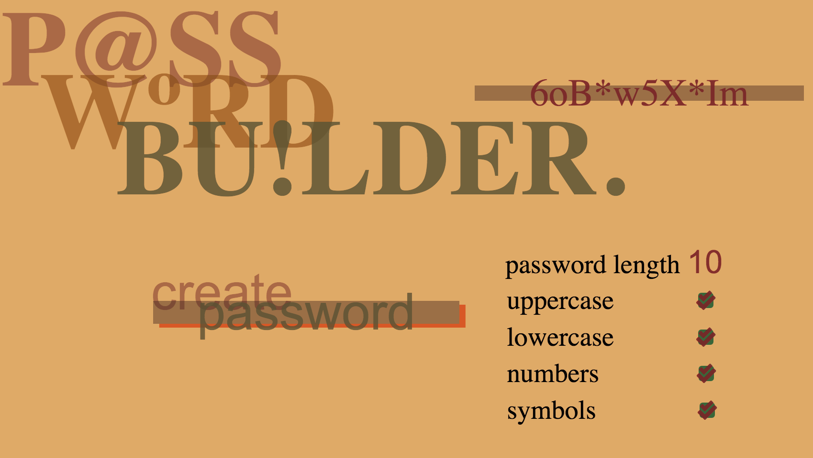

# Password Generator

The current build of this app is utilizing SASS as well as Javascript to run the password generation. I really wanted to work on more SASS so i decided to build this app fully in the browser and not through ```alert``` funtions in Javascript




A main pillar of the Javascript functionality was learning about 
```
string.fromCharCode()
```
more documentaion can be found on it here: https://developer.mozilla.org/en-US/docs/Web/JavaScript/Reference/Global_Objects/String/fromCharCode

and the documentation for what ```string.fromCharCode()``` targets can be found here: https://www.ascii-code.com/

in ```getRandomSymbol``` i just created a variable of some symbols that i wanted to use becuase they weren't in sequecial order in the ASCII documentaion

Another important piece to this puzzle was using ```Object()``` and ```Object.keys()``` to be able to not only randomoize the arrays of the letters, numbers, and symbols, but also the elements inside of them. 

documentation can be found on that here: https://developer.mozilla.org/en-US/docs/Web/JavaScript/Reference/Global_Objects/Object & https://developer.mozilla.org/en-US/docs/Web/JavaScript/Reference/Global_Objects/Object/keys

I also came across a bug where users were able to bypass the min/max of the 'password length' by not using the up and down arrows and just manually entering in a number. I set alerts to ask the user to stay within the parameters and then reset the application.

I am currently working on writing a function that will change the size of the passwords font when it exceeds a certain length to keep the design in tact. 